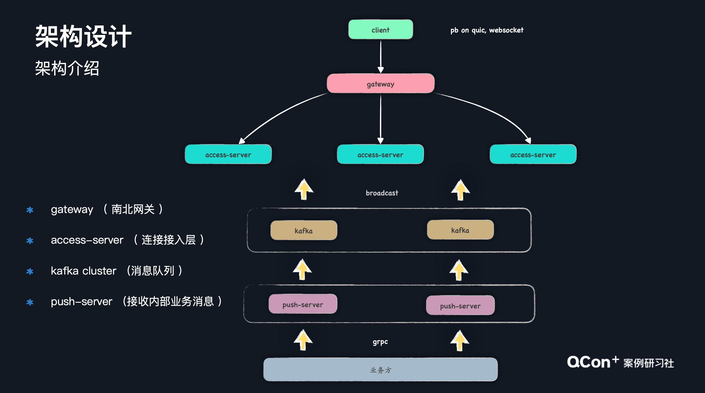
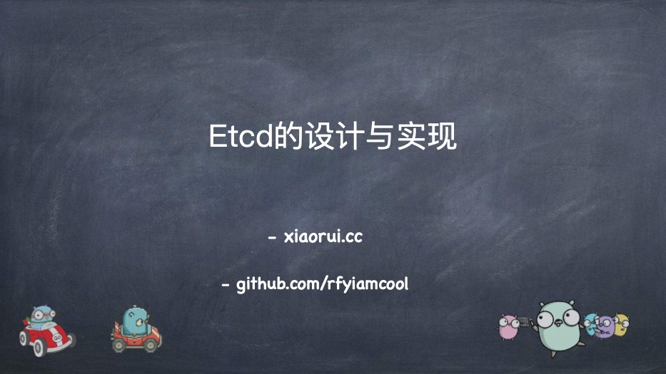
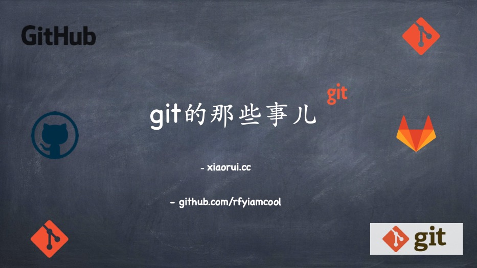
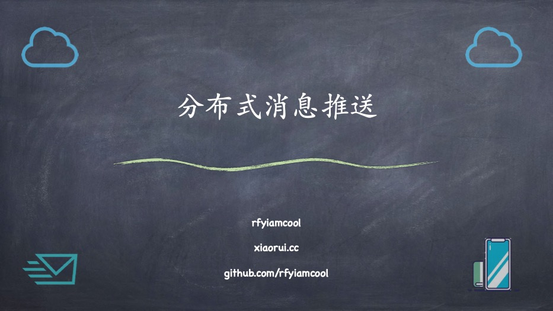
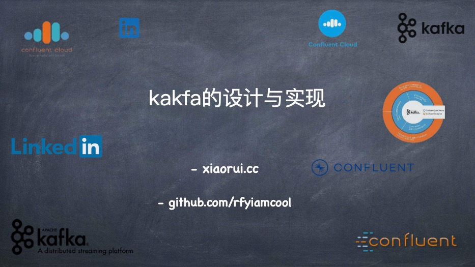
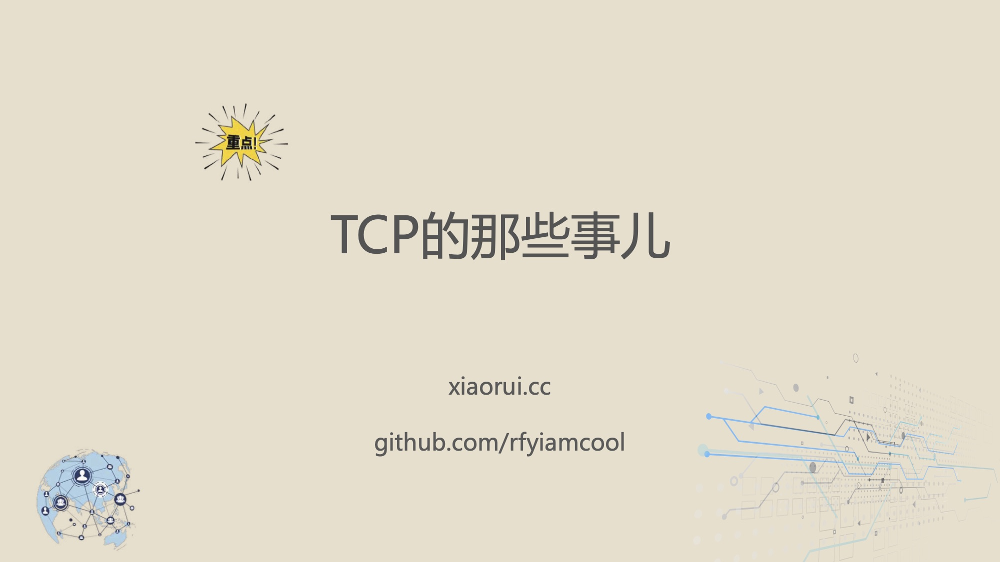
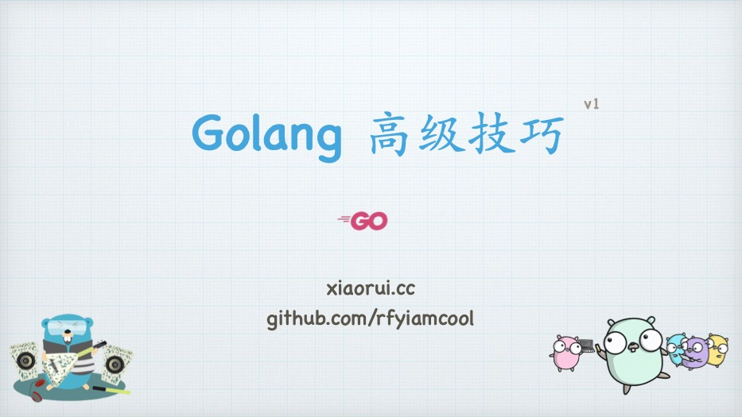
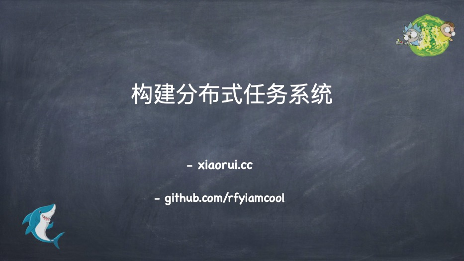
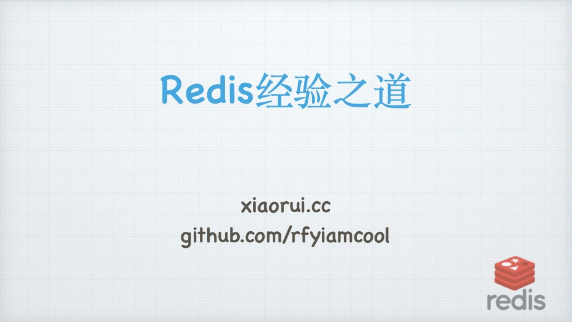

# 技术分享PPT

在公司内部及社区中分享的PPT.

## Download

[download in github](https://github.com/rfyiamcool/share_ppt/tags)

## Agenda

- [Qcon海量长连接消息推送系统实践](#Qcon海量长连接消息推送系统实践)
- [网络编程那些事儿](#网络编程那些事儿)
- [Golang项目实战](#Golang项目实战)
- [Etcd的设计与实现](#Etcd的设计与实现)
- [git的那些事儿](#GIT的那些事儿)
- [分布式消息推送](#分布式消息推送)
- [Kafka的设计与实现](#Kafka的设计与实现)
- [TCP的那些事儿](#TCP的那些事儿)
- [Golang高级编程技巧](#Golang高级技巧)
- [GRPC的那些事儿](#GRPC的那些事儿)
- [分布式任务系统](#分布式任务系统)
- [优雅的编程者](#优雅的编程者)
- [分布式行情推送系统(golang)](#分布式行情推送系统golang)
- [Redis经验之谈](#Redis经验之谈)
- [http2和quic的那些事儿](#http2和quic的那些事儿)
- [kubernetes的那些事儿](#kubernetes的那些事儿)
- [istio的那些事儿](#istio的那些事儿)
- [Service Mesh的那些事儿](#Service-Mesh的那些事儿)
- [RedisCluster那些事儿](#RedisCluster那些事儿)
- [golang高级讲义](#golang高级讲义)
- [golang高性能实战](#golang高性能实战)
- [mysql快速讲义](#mysql快速讲义)
- [微服务那些事儿](#微服务那些事儿)
- [异步io调度框架的实现](#异步io调度框架的实现)
- [cdn设计原理](#cdn设计原理)
- [分析mysql acid设计实现](#分析mysql-acid设计实现)
- [Python Gil全局锁那些事儿](#Python-Gil全局锁那些事儿)
- [Redis设计实现](#Redis设计实现)
- [分布式一致性raft实现原理](#分布式一致性raft实现原理)
- [Python高级内存管理](#Python高级内存管理)
- [美妙的多进程管理](#美妙的多进程管理)
- [聊聊集群管理](#聊聊集群管理)

## LIST

### Qcon海量长连接消息推送系统实践

#### 分享时间

2021-06-30
#### 内容

- 超百万的⻓连接接入
- 每天近 100 亿条消息
- 高峰值时每秒 70w+ 条消息 目标
- 如何尽量保证消息的低延迟
- 如何保证系统的高并发
- 如何保证消息的可靠性
- 如何保证系统的可用性
- ...

#### ppt地址

[下载地址](qcon_push_service.pdf)

#### 截图

### 网络编程那些事儿

#### 分享时间

2021-12-16

#### 内容

- 收包发包原理, socket及阻塞非阻塞, 同步异步的本质
- linux 五种IO模型
- io多路复用模型
  - select
  - poll
  - epoll
    - 数据结构组成
    - 如何使用 epoll 的那几个方法
    - 从底层来讲解 epoll 的实现原理
    - epolloneshot 的场景
    - 水平触发和边缘触发到底是怎么一回事, 各种case来描述
    - 社区中常见的服务端使用 epoll 哪种触发模型
    - epoll 的开发技巧
  - io_uring
- aio 到底是怎么一回事？ 存在的问题
- 当前社区比较流行的 网络编程 模型
  - 新线程模型
  - 单多路复用 + 业务线程池模型
  - prefork 模型
  - reactor
  - proactor
- 常见的网络编程问题
  - 半连接全连接代表的意思，如何配置，不同内核参数下表现形式
  - 常见的读写返回值的处理方式
  - reuseaddr vs reuseport
  - epoll 的惊群问题
  - 粘包半包
  - 半关闭
  - 如何实现异步 connect
  - 弱网络问题, kcp
  - fork, exec, system 在继承传递 fd 的问题
  - 如何实现网络服务的 upgrade
  - 论心跳的重要性, 为什么使用应用层心跳
  - 如何处理各种的网络异常问题

#### ppt地址

[下载地址](network_server.pdf)

#### 截图

### Golang项目实战

#### 分享时间

2021-11-08

#### 内容

- 代码规范
- 接口规范
- Git规范
- 常见设计模式
- Golang开发经验
- Golang编码技巧

#### ppt地址

[下载地址](golang_skills.pdf)

#### 截图

### Etcd的设计与实现

#### 分享时间

2021-07-05

#### 内容

- raft共识算法
- boltdb知识点
- etcd自身的功能实现
  - 关键结构体
  - mvcc实现
  - treeindex及boltdb存储布局
  - txn事务的实现
  - watch监听的实现
  - lease监听的实现
  - compact的实现
  - defrag的实现
  - 锁的实现
- etcd的使用经验

#### ppt地址

[下载地址](etcd_cluster.pdf)

#### 截图

### GIT的那些事儿

#### 分享时间

2021-04-21

#### 内容

- git由来
- git原理 (大篇幅讲解)
- git规范 (git-flow工作流讲解)
- git技巧

#### ppt地址

[下载地址](git.pdf)

#### 截图

### 分布式消息推送

#### 分享时间

2021-03-24

#### ppt地址

[在线观看](null)

[下载地址](message_pusher.pdf)

#### 截图

### Kafka的设计与实现

#### 分享时间

2021-02-23

#### ppt地址

[在线观看](null)

[下载地址](kafka.pdf)

#### 截图

### TCP的那些事儿

#### 分享时间

2021-01-06

#### ppt地址

[在线观看](https://myslide.cn/slides/23281)

[下载地址](tcp_protocol.pdf)

#### 截图

### Golang高级技巧

#### 分享时间

2020-11-15

#### ppt地址

[在线观看](https://myslide.cn/slides/23112)

[下载地址](golang_tips.pdf)

#### 截图

### GRPC的那些事儿

#### 分享时间

2020-09-30

#### ppt地址

[在线观看](https://myslide.cn/slides/23114)

[下载地址](grpc.pdf)

#### 截图

讲述了grpc的特点, 使用方法及生产环境中的经验，话题包括了http1.1, http2.0, http3.0的实现, protobuf的编码实现, wireshark抓包分析grpc等等.

### 分布式任务系统

#### 分享时间

2020-06

#### ppt地址

[在线观看](https://myslide.cn/slides/23115)

[下载地址](shark.pdf)

#### 截图

### 优雅的编程者

#### 分享时间

2020-03

#### ppt地址

[在线观看](https://myslide.cn/slides/23113)

[下载地址](drunbility.pdf)

#### 截图

### 分布式行情推送系统golang

#### 分享时间

2019-12

#### ppt地址

[在线观看](https://myslide.cn/slides/23117)

[下载地址](push_cluster.pdf)

### Redis经验之谈

#### 分享时间

2019-11

#### 截图

#### ppt地址

[在线观看](https://myslide.cn/slides/23118)

[下载地址](redis_qa.pdf)

### http2和quic的那些事儿

#### 分享时间

2019-08

#### ppt地址

[在线观看](https://myslide.cn/slides/23116)

[下载地址](http2quic.pdf)

### kubernetes的那些事儿

#### 分享时间

2019-08

#### ppt地址

[在线观看](https://myslide.cn/slides/23120)

[下载地址](k8s.pdf)

### istio的那些事儿

#### 分享时间

2019-07

#### ppt地址

[在线观看](https://myslide.cn/slides/23119)

[下载地址](istio.pdf)

### ServiceMesh的那些事儿

#### 分享时间

2019-07

#### ppt地址

[在线观看](https://myslide.cn/slides/23121)

[下载地址](service_mesh.pdf)

### RedisCluster那些事儿

#### 分享时间

2019-02

#### ppt地址

[在线观看](https://myslide.cn/slides/23122)

[下载地址](redis_cluster.pdf)

### golang高级讲义

#### 分享时间

2018-07

#### ppt地址

[在线观看](https://myslide.cn/slides/23123)

[下载地址](golang_advance.pdf)

### golang高性能实战

#### 分享时间

2018-03

#### ppt地址

[在线观看](https://myslide.cn/slides/23124)

[下载地址](golang_fast.pdf)

### mysql快速讲义

#### 分享时间

2017-08

#### ppt地址

[在线观看](https://myslide.cn/slides/23130)

[下载地址](mysql_fast.pdf)

### redis高级讲义

#### 分享时间

2017-05

#### ppt地址

[在线观看](https://myslide.cn/slides/23129)

[下载地址](redis_advance.pdf)

### 微服务那些事儿

#### 分享时间

2017-02

#### ppt地址

[在线观看](https://myslide.cn/slides/23128)

[下载地址](micro_service.pdf)

### 异步io调度框架的实现

#### 分享时间

2016-12

#### ppt地址

[在线观看](https://myslide.cn/slides/23127)

[下载地址](async_frame.pdf)

### cdn设计原理

#### 分享时间

2016-07

#### ppt地址

[在线观看](https://myslide.cn/slides/23126)

[下载地址](cdn_design.pdf)

### 分析mysql acid设计实现

#### 分享时间

2016-05

#### ppt地址

[在线观看](https://myslide.cn/slides/23131)

[下载地址](mysql_acid.pdf)

### Python Gil全局锁那些事儿

#### 分享时间

2016-04

#### ppt地址

[在线观看](https://myslide.cn/slides/23132)

[下载地址](python_gil.pdf)

### Redis设计实现

#### 分享时间

2016-03

#### ppt地址

[在线观看](https://myslide.cn/slides/23133)

[下载地址](rediscode.pdf)

### 分布式一致性raft实现原理

#### 分享时间

2015-08

#### ppt地址

[在线观看](https://myslide.cn/slides/23134)

[下载地址](raft_design.pdf)

### Python高级内存管理

#### 分享时间

2015-06

#### ppt地址

[在线观看](https://myslide.cn/slides/23135)

[下载地址](pygc.pdf)

### 美妙的多进程管理

#### 分享时间

2015-02

#### ppt地址

[在线观看](https://myslide.cn/slides/23136)

[下载地址](python_process.pdf)

### 聊聊集群管理

#### 分享时间

2014-09

#### ppt地址

[下载地址](devops_cluster.pdf)
